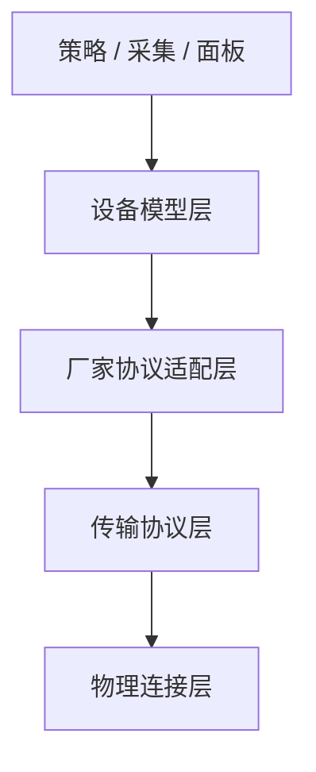

# 架构分层与设备接入演进说明

> 这是一份架构边界文档，不是接第一台真机时的首选入口。先看 [docs/README.md](/C:/Users/Lenovo/Desktop/桌面工作空间/终端台区智能化项目/后台项目/edgefusion/docs/README.md)。

本文档说明 EdgeFusion 在真实设备接入前后的推荐分层方式，明确设备模型、厂家协议适配、传输协议、物理连接之间的边界，并给出当前代码的落点和后续迭代顺序。

如果当前目标是“先把一台真实 Modbus 设备最快接通”，直接配合阅读：

- `docs/modbus-device-onboarding-fast-path.md`
- `docs/examples/modbus-explicit-mapping-templates.yaml`

本文档和 [device-models-and-adaptation.md](./device-models-and-adaptation.md) 的区别是：

- `device-models-and-adaptation.md` 更偏“当前各类设备怎么建模、怎么接”
- 本文档更偏“系统层面应该怎么分层、后续代码应该往哪里收”

## 1. 设计目标

项目要解决的核心问题，不是“只支持某一种协议”，而是：

- 在真实设备未到位前，先用统一设备模型完成仿真联调
- 在真实设备到位后，只补厂家适配和连接层，不改业务策略
- 同一类设备即使换协议，也尽量复用相同的业务语义
- 同一种应用协议即使换物理承载，也尽量复用相同的协议适配逻辑
- 当前真实设备主路径以 Modbus 为主，后续的 MQTT / CAN / HTTP 更适合作为补充协议支持，而不是反过来主导设备建模

因此系统应拆成四层，而不是把设备类型、厂家点表、网络连接混在一起。

## 2. 推荐分层

### 2.1 设备模型层

这一层只定义业务语义，不定义寄存器地址、topic 名称、串口参数。

例如：

- `grid_meter`: `power`, `status`
- `pv`: `power`, `energy`, `voltage`, `current`, `status`, `power_limit`
- `energy_storage`: `soc`, `power`, `mode`, `max_charge_power`, `max_discharge_power`
- `charging_connector`: `status`, `power`, `energy`, `voltage`, `current`, `power_limit`

这一层的消费方包括：

- 采集快照
- 站级状态构建
- 模式控制
- 反送保护
- 监控面板展示

判断标准：

- 这一层不应该出现 `0x210E`
- 这一层不应该出现 `devices/xxx/control/power_limit`
- 这一层只关心“这个设备现在有什么状态、能执行什么语义控制”

### 2.2 厂家协议适配层

这一层负责把设备模型翻译成具体厂家的协议字段。

例如：

- Modbus 点表
- MQTT topic / payload 映射
- OCPP 消息字段映射
- 厂家状态码到统一状态的映射
- 厂家控制命令到统一控制语义的映射

这一层是“同一类设备、不同厂家”的差异收口层。

判断标准：

- 可以出现寄存器地址
- 可以出现 topic 名称
- 可以出现状态枚举转换
- 但不应该直接操作 TCP socket 或串口对象

### 2.3 传输协议层

这一层负责实现某种应用协议如何读写。

例如：

- Modbus 请求与响应
- MQTT 发布与订阅
- OCPP 请求与会话

这一层知道“怎样发送一个 Modbus 读寄存器请求”，但不应该知道“储能的 `soc` 是哪个寄存器”。

判断标准：

- 可以出现 `read_holding_registers`
- 可以出现 `publish(topic, payload)`
- 不应该出现 `soc`, `power_limit`, `max_charge_power` 这种设备业务字段

### 2.4 物理连接层

这一层负责连接介质和连接生命周期。

例如：

- Modbus TCP
- Modbus RTU
- MQTT over TCP/TLS
- OCPP over WebSocket

这一层只关心：

- IP / 端口
- 串口名 / 波特率 / 校验位
- TLS 证书
- 重连、超时、心跳

这一层不应该知道设备模型，也不应该知道厂家点表。

## 3. 补充协议支持怎么做

先明确一个原则：

- 设备接入的第一问题是“它属于哪类设备模型”，不是“它走什么协议”
- 协议支持是补充能力，用来承接已经存在的设备模型
- 在当前项目里，Modbus 是主路径；MQTT / CAN / HTTP 应按补充协议支持来设计

因此“补协议”和“接设备”应分开理解：

- **接设备**：补厂家 profile、状态映射、控制命令映射
- **补协议**：补这一类协议的适配层、传输层、物理连接层

下面的模板描述的是“如何补一条协议支持”，不是“如何接某一台设备”

### 3.1 Modbus

当前项目默认真实设备世界观基本是 Modbus TCP，这条线应继续作为第一优先级完善。

推荐拆分：

- `ModbusProfile` 或点表适配：定义字段、类型、倍率、命令
- `ModbusProtocol`：定义读保持寄存器、写寄存器、批量写等协议行为
- `ModbusTcpTransport`：负责 TCP 连接
- `ModbusRtuTransport`：负责串口 RTU 连接

这样可以实现：

- 同一个厂家点表同时跑在 TCP 或 RTU 上
- 上层不用关心现场设备到底是以太网还是串口

### 3.2 MQTT

MQTT 属于**补充应用层协议支持**，不是设备模型本身。

补 MQTT 时，建议按下面三层补：

- 厂家协议适配层：
  - 字段对应哪个 topic
  - 控制命令发哪个 topic / payload
  - topic payload 到统一语义字段的映射
- 传输协议层：
  - 订阅
  - 发布
  - 消息解析
  - 最近值缓存
  - QoS / retained / session 这类 MQTT 语义
- 物理连接层：
  - MQTT over TCP
  - MQTT over TLS
  - MQTT over WebSocket
  - broker 地址、认证、重连、心跳

推荐文件落点：

- `adapters/mqtt/`：topic / payload 映射
- `protocol/mqtt.py`：MQTT publish / subscribe / cache
- `transport/mqtt_broker.py`：broker 连接管理

最小接通标准：

- 能把 topic 数据映射成统一设备字段
- 能把控制语义下发成 MQTT 消息
- 业务层不感知 broker、topic 细节

### 3.3 CAN

CAN 要特别注意：**CAN 本身更接近总线/链路承载，不等于完整应用层协议。**

所以补 “CAN 支持” 时，必须明确区分两层：

- 应用层：
  - 是自定义帧语义
  - 还是 CANopen / J1939 / 厂家私有对象字典
  - 一帧或多帧如何映射到 `soc/power/status` 这类统一字段
  - 控制命令如何编码成帧
- 物理层 / 连接层：
  - CAN / CAN FD
  - USB-CAN
  - PCIe CAN 卡
  - 串口转 CAN 网关
  - 波特率、通道号、过滤器、重连

在这个项目里，如果要补 CAN，建议拆成：

- `adapters/can/`：帧语义映射、对象字典映射、命令编码规则
- `protocol/can.py`：收发帧、组帧/解帧、请求响应或周期帧处理
- `transport/can_bus.py`：具体 CAN 接口、通道、波特率、驱动生命周期

最小接通标准：

- 能把原始帧解析为统一字段
- 能把统一控制语义编码成 CAN 帧
- 明确写清应用层协议不是 “CAN” 三个字就结束

### 3.4 HTTP

HTTP 也是**补充应用层协议支持**。

补 HTTP 时建议按下面三层补：

- 厂家协议适配层：
  - 哪个语义字段对应哪个 URL / 方法 / 请求体 / 响应体
  - 鉴权头、设备 ID、站点 ID 的映射
  - 厂家状态码到统一状态的转换
- 传输协议层：
  - GET / POST / PUT
  - 请求超时、重试、响应解析
  - 轮询读取和写入控制
- 物理连接层：
  - HTTP over TCP
  - HTTPS / TLS
  - 代理、证书、Keep-Alive、连接池

推荐文件落点：

- `adapters/http/`：字段到 REST/API 的映射
- `protocol/http.py`：请求发送、响应解析、轮询封装
- `transport/http_client.py`：session、TLS、连接池、认证

最小接通标准：

- 能把接口响应映射成统一字段
- 能把控制语义转换成 HTTP 请求
- 业务层不感知 URL、Header、认证细节

## 4. 后续真正要做的事

当前 Modbus 主链路已经基本成型，后续不再继续做大规模分层重构。

后面的工作主要分两类：

### 4.1 有新厂家资料时，补厂家 profile

落点：

- `adapters/modbus/profiles/vendors/`

内容：

- `telemetry_map`
- `control_map`
- `status_map / mode_map`
- 厂家别名、型号别名、默认模型

原则：

- 只补适配层
- 不改业务层
- 优先先补最小必需字段，再补高级能力

### 4.2 有新协议需求时，补协议支持

步骤：

1. 先确认设备模型不变
2. 再补 `adapters/<protocol>/`
3. 再补 `protocol/<protocol>.py`
4. 最后补 `transport/<protocol transport>.py`

原则：

- 补协议，不改设备模型
- 业务层仍只看到统一语义字段
- 明确区分应用层协议和物理连接层

### 4.3 继续保持手工接入主导

原则：

- 不扩重型自动发现体系
- 不为了分层继续拆 `DeviceManager`
- 当前结构够支撑后续接真机，后面以补厂家和补协议为主

### 第二步：按需补充协议支持

目标：

- 在 Modbus 主路径之外，按现场需要补 MQTT / CAN / HTTP

最小要求：

- 先明确设备模型不变
- 再明确应用层协议语义怎么映射
- 最后明确它跑在哪个物理连接层上

补充协议时推荐顺序：

1. 先补 `adapters/<protocol>/`
2. 再补 `protocol/<protocol>.py`
3. 最后补 `transport/<protocol transport>.py`

判断标准：

- 业务层仍只看到 `power/soc/status/power_limit`
- 不因为补一个协议，就把设备模型改成“按协议分类”

### 第三步：继续扩展厂家 profile 和能力配置组织

目标：

- 让 `point_tables/register_map` 的兼容职责维持在边界层，不再回流到主链路

重点：

- 把新增厂家映射优先落到 `adapters/modbus/profiles/vendors/` 这类厂家 profile 模块，并通过注册入口暴露给设备族聚合层
- 保留 `status_map/mode_map/capabilities` 这类适配层元数据
- 让新设备接入优先补 profile，而不是补业务层分支

补充约束：

- 运行时正式主接口固定为 `telemetry_map` / `control_map`
- 厂家 profile、点表和手工显式配置都只能产出这两个 map，不再保留平行别名入口
- `register_map.py` 只负责解析正式主接口，不再承担旧字段兼容吸收
- 设备能力摘要应同时暴露正式词表和未知扩展字段，便于现场接入时快速识别哪些字段可进入业务主链

## 5. 按设备类型落地步骤

这一章回答的是：**现场拿到一台新设备后，具体该怎么落地。**

统一原则：

1. 先确定设备模型类型
2. 再确定厂家 profile 是否已存在
3. 再确定它跑在哪条协议栈上
4. 最后做最小联调验证

不要反过来做：

- 不要先写协议代码，再猜它属于什么设备
- 不要直接在业务层加 `if 厂家A`
- 不要把“寄存器能读出来”当成“设备已经接通”

### 8.1 总表

第一步先确认它是不是 `grid_meter`：

- 核心语义只有 `power` 和 `status`
- `power` 的正负方向必须先在现场确认
- 如果方向没确认，后面的站级判断都不可信

落地顺序：

1. 确认厂家 profile 是否已存在
2. 如果没有，先补 `adapters/.../vendors/<vendor>.py`
3. 至少补：
   - `telemetry_map.power`
   - `telemetry_map.status`
   - `status_map`
4. 如果现场配置不是内部 model key，就补厂家别名、型号别名、默认模型
5. 再确认它走 Modbus / MQTT / CAN / HTTP 哪条协议栈

最小联调检查：

- 能稳定读到 `power`
- 断开设备时 `status` 或缺测能反映异常
- 取电 / 反送方向和现场仪表一致
- 采集层读不到 `power` 时不会被伪装成正常 0 值

### 8.2 光伏

第一步先确认它是不是 `pv`：

- 最核心的是 `power`
- 次核心是 `status`
- 有闭环控制需求时，再补 `power_limit`

落地顺序：

1. 先补光伏的 `telemetry_map`
2. 再补 `status_map`
3. 如果需要参与控制，再补 `control_map.power_limit`
4. 如果厂家还提供 `available_power`、`min_power_limit`，可以补进 profile，但不要先让业务层强依赖
5. 最后确认协议栈和物理连接参数

最小联调检查：

- 能读到实时 `power`
- 状态能归一成统一语义
- 下发 `power_limit` 后，设备侧行为与预期一致
- 限功失败不会被误判成“设备支持控制”

### 8.3 储能

第一步先确认它是不是 `energy_storage`：

- 最关键字段是 `soc`、`power`、`mode`
- 控制侧至少要看 `charge_power / discharge_power / mode`

落地顺序：

1. 先补 `telemetry_map.soc`
2. 再补 `telemetry_map.power`、`telemetry_map.mode`
3. 再补 `mode_map`
4. 如果要参与控制，再补：
   - `control_map.mode`
   - `control_map.charge_power`
   - `control_map.discharge_power`
5. 如果有最大充放电能力，再补：
   - `max_charge_power`
   - `max_discharge_power`

最小联调检查：

- `soc` 数值和现场界面一致
- `power` 的充放电方向已确认
- `mode` 能归一成统一语义
- 控制命令下发后，设备实际功率响应符合预期

### 8.4 充电桩

第一步先确认它是不是 `charging_station`，然后再确认控制对象是不是 `charging_connector`。

在当前项目里，充电桩落地必须按这个思路：

- 资产管理和接入按桩
- 采集和控制按枪

落地顺序：

1. 先补桩级 profile
2. 确认 connector 数量、枪号规则、共享功率约束
3. 再补 connector 级 telemetry / control 映射
4. 再补 `connector_status_map` / `connector_mode_map`
5. 如果厂家命令是复杂报文，再把 builder 和固定命令值落到 profile 里，而不是写到面板逻辑里

最小联调检查：

- connector 视图展开正确
- 枪状态能归一成 `idle / charging / fault`
- `power_limit` 或 `start/stop` 命令能通过统一语义链路下发
- 双枪共享功率时，不会因为按枪调度而越过整桩约束

### 8.5 拿到厂家资料后的最小动作

无论是哪类设备，拿到厂家资料后，建议先做这几步：

1. 先圈出最小必需字段，不要一上来全量录点
2. 先补可读字段，再补可写字段
3. 先补状态归一，再补高级能力
4. 先用最小 profile 跑通，再补别名和默认模型

最小必需字段建议：

- 总表：`power`, `status`
- 光伏：`power`, `status`, 可选 `power_limit`
- 储能：`soc`, `power`, `mode`
- 充电枪：`status`, `power`, 可选 `power_limit`

## 6. 对后续接入速度的意义

如果按本文档迭代，后续接真机会更快，原因不是“协议更多了”，而是“每次接入改动范围更小了”。

理想状态下，一台新设备接入只需要回答三类问题：

1. 它属于哪类设备模型
2. 它的厂家适配怎么写
3. 它跑在哪个传输协议和连接介质上

如果这三层清楚，后面接入新设备时就不需要反复改策略层、采集层和面板层。

## 7. 当前结论

当前项目已经完成了最重要的一步：

- 业务开始围绕统一设备语义建模

但要真正加快真机接入速度，还需要继续做两件事：

- 把厂家适配从设备模型里再剥离一点
- 把传输协议和物理连接彻底拆开

在工控机现场调试场景下，不建议把“自动发现”做成重型框架；更实际的方向是保持手工接入主导，同时把设备清单、生命周期、协议编排边界收清楚。

后续所有重构和新协议接入，都建议以这个分层为准，而不要再把“设备类型 = 协议类型 = 连接方式”绑定在一起。
