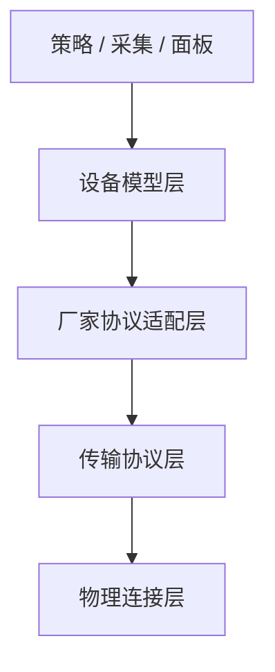

# 架构分层与设备接入演进说明

本文档说明 EdgeFusion 在真实设备接入前后的推荐分层方式，明确设备模型、厂家协议适配、传输协议、物理连接之间的边界，并给出当前代码的落点和后续迭代顺序。

本文档和 [device-models-and-adaptation.md](./device-models-and-adaptation.md) 的区别是：

- `device-models-and-adaptation.md` 更偏“当前各类设备怎么建模、怎么接”
- 本文档更偏“系统层面应该怎么分层、后续代码应该往哪里收”

## 1. 设计目标

项目要解决的核心问题，不是“只支持某一种协议”，而是：

- 在真实设备未到位前，先用统一设备模型完成仿真联调
- 在真实设备到位后，只补厂家适配和连接层，不改业务策略
- 同一类设备即使换协议，也尽量复用相同的业务语义
- 同一种应用协议即使换物理承载，也尽量复用相同的协议适配逻辑

因此系统应拆成四层，而不是把设备类型、厂家点表、网络连接混在一起。

## 2. 推荐分层



### 2.1 设备模型层

这一层只定义业务语义，不定义寄存器地址、topic 名称、串口参数。

例如：

- `grid_meter`: `power`, `status`
- `pv`: `power`, `energy`, `voltage`, `current`, `status`, `power_limit`
- `energy_storage`: `soc`, `power`, `mode`, `max_charge_power`, `max_discharge_power`
- `charging_connector`: `status`, `power`, `energy`, `voltage`, `current`, `power_limit`

这一层的消费方包括：

- 采集快照
- 站级状态构建
- 模式控制
- 反送保护
- 监控面板展示

判断标准：

- 这一层不应该出现 `0x210E`
- 这一层不应该出现 `devices/xxx/control/power_limit`
- 这一层只关心“这个设备现在有什么状态、能执行什么语义控制”

### 2.2 厂家协议适配层

这一层负责把设备模型翻译成具体厂家的协议字段。

例如：

- Modbus 点表
- MQTT topic / payload 映射
- OCPP 消息字段映射
- 厂家状态码到统一状态的映射
- 厂家控制命令到统一控制语义的映射

这一层是“同一类设备、不同厂家”的差异收口层。

判断标准：

- 可以出现寄存器地址
- 可以出现 topic 名称
- 可以出现状态枚举转换
- 但不应该直接操作 TCP socket 或串口对象

### 2.3 传输协议层

这一层负责实现某种应用协议如何读写。

例如：

- Modbus 请求与响应
- MQTT 发布与订阅
- OCPP 请求与会话

这一层知道“怎样发送一个 Modbus 读寄存器请求”，但不应该知道“储能的 `soc` 是哪个寄存器”。

判断标准：

- 可以出现 `read_holding_registers`
- 可以出现 `publish(topic, payload)`
- 不应该出现 `soc`, `power_limit`, `max_charge_power` 这种设备业务字段

### 2.4 物理连接层

这一层负责连接介质和连接生命周期。

例如：

- Modbus TCP
- Modbus RTU
- MQTT over TCP/TLS
- OCPP over WebSocket

这一层只关心：

- IP / 端口
- 串口名 / 波特率 / 校验位
- TLS 证书
- 重连、超时、心跳

这一层不应该知道设备模型，也不应该知道厂家点表。

## 3. 当前项目的实际状态

当前项目的方向是对的，但分层仍在演进中。

### 3.1 已经比较合理的部分

- 业务侧已经大量使用统一语义字段，而不是直接读写寄存器
- 光、储、充、总表已经有统一设备模型雏形
- 充电桩已经实现“桩接入、枪控制”
- `DeviceManager` 已经承担了统一语义入口
- 设备适配层已经补上 `status/mode` 归一和 `capabilities` 声明，策略层不再直接依赖厂家原始状态码判断可控性

### 3.2 还没有拆干净的部分

- `point_tables.py` 仍同时承担了“设备模型描述”和“协议映射描述”
- `register_map.py` 已经是适配层的一部分，但仍保留兼容入口
- `Modbus` 已经拆出 `modbus_factory.py + protocol/modbus.py + transport/modbus_tcp.py + transport/modbus_rtu.py`，但点表适配和厂家 profile 组织仍有继续收口空间
- `MQTTProtocol` 仍然是骨架，没有形成完整的“适配层 + 协议层 + 连接层”
- `DeviceManager` 已经不再自己拼 Modbus transport，但仍是当前的协议编排入口，后续可以继续向独立 provider / registry 收口

## 4. 当前代码归位建议

下表描述当前主要文件更接近哪一层，以及后续应如何调整。

| 文件 | 当前角色 | 推荐归位 |
|------|----------|----------|
| `edgefusion/monitor/collector.py` | 采集 | 设备模型层消费方 |
| `edgefusion/control/site_state.py` | 站级状态 | 设备模型层消费方 |
| `edgefusion/control/export_protect.py` | 站级控制 | 设备模型层消费方 |
| `edgefusion/strategy/mode_controller.py` | 模式控制 | 设备模型层消费方 |
| `edgefusion/charger_layout.py` | 设备视图展开 | 设备模型层 |
| `edgefusion/adapters/device_profiles.py` | 设备语义适配入口 | 厂家协议适配层 |
| `edgefusion/point_tables.py` | 型号点表 | 厂家协议适配层 |
| `edgefusion/register_map.py` | 语义到协议映射 | 厂家协议适配层 |
| `edgefusion/protocol/modbus_factory.py` | Modbus 协议组装与 endpoint 归一 | 编排 / 组合根 |
| `edgefusion/protocol/modbus.py` | Modbus 实现 | 传输协议层 |
| `edgefusion/transport/modbus_tcp.py` | Modbus TCP 连接承载 | 物理连接层 |
| `edgefusion/transport/modbus_rtu.py` | Modbus RTU 连接承载 | 物理连接层 |
| `edgefusion/protocol/mqtt.py` | MQTT 实现 | 传输协议层骨架 |
| `edgefusion/device_manager.py` | 统一入口 | 编排层，不应长期承载过多协议细节 |

## 5. 推荐目标形态

后续可以逐步收敛成下面这种结构，不要求一次性完成。

```text
edgefusion/
├── models/                 # 设备模型层
├── adapters/               # 厂家协议适配层
│   ├── modbus/
│   ├── mqtt/
│   └── ocpp/
├── protocol/               # 传输协议层
│   ├── modbus.py
│   ├── mqtt.py
│   └── ocpp.py
├── transport/              # 物理连接层
│   ├── modbus_tcp.py
│   ├── modbus_rtu.py
│   └── mqtt_broker.py
└── ...
```

说明：

- `models/` 不依赖寄存器地址
- `adapters/` 负责厂家差异
- `protocol/` 负责协议收发
- `transport/` 负责 TCP、RTU、TLS 这些连接细节

## 6. 协议与连接的拆分原则

### 6.1 Modbus

当前项目默认真实设备世界观基本是 Modbus TCP，这条线应继续作为第一优先级完善。

推荐拆分：

- `ModbusProfile` 或点表适配：定义字段、类型、倍率、命令
- `ModbusProtocol`：定义读保持寄存器、写寄存器、批量写等协议行为
- `ModbusTcpTransport`：负责 TCP 连接
- `ModbusRtuTransport`：负责串口 RTU 连接

这样可以实现：

- 同一个厂家点表同时跑在 TCP 或 RTU 上
- 上层不用关心现场设备到底是以太网还是串口

### 6.2 MQTT

MQTT 不应只保留一个协议骨架，而应拆成：

- MQTT 语义映射：字段对应哪个 topic，控制命令发什么 payload
- MQTT 协议处理：订阅、发布、消息解析、缓存
- Broker 连接管理：broker 地址、认证、TLS、重连

只有这样，MQTT 设备才能真正和 Modbus 设备站在同一层语义抽象上。

## 7. 面向真机接入的迭代顺序

推荐按以下顺序推进，而不是同时全面铺开。

### 第一步：把 Modbus 分层补干净

目标：

- 保持当前已打通的 Modbus TCP 主链路
- 从代码结构上把“点表适配”和“TCP 连接”再拉开一点
- 让 TCP / RTU 进入同一条语义接入通路

当前进展：

- 已新增 `adapters/device_profiles.py` 作为设备适配层入口
- 已新增 `transport/modbus_tcp.py` 作为 Modbus TCP 物理连接承载
- 已新增 `transport/modbus_rtu.py` 作为 Modbus RTU 物理连接承载
- 已新增 `protocol/modbus_factory.py` 负责 Modbus protocol + transport 组装和 endpoint 归一
- `DeviceManager` 已改为优先走适配层入口，并通过 factory 复用默认 endpoint / 派生专用 endpoint
- `ModbusProtocol` 已改为依赖显式注入的 transport，而不再自己选择 TCP / RTU 实现

剩余优先事项：

- 继续弱化 `point_tables` 的设备模型角色
- 继续明确 `register_map` 的兼容边界
- 继续把厂家 profile 从大一统点表拆成更清晰的模块边界

### 第二步：补 MQTT 真正的读链路

目标：

- 让 MQTT 储能或其他 MQTT 设备真正进入采集闭环

最小要求：

- 订阅主题
- 最近值缓存
- 语义字段到 topic 的映射
- 控制 topic / payload 模板

### 第三步：继续拆厂家 profile 和能力配置组织

目标：

- 让 `point_tables/register_map` 不再承担过多“兼容入口”职责

重点：

- 把厂家映射从统一大文件里继续拆分
- 保留 `status_map/mode_map/capabilities` 这类适配层元数据
- 让新设备接入优先补 profile，而不是补业务层分支

## 8. 对后续接入速度的意义

如果按本文档迭代，后续接真机会更快，原因不是“协议更多了”，而是“每次接入改动范围更小了”。

理想状态下，一台新设备接入只需要回答三类问题：

1. 它属于哪类设备模型
2. 它的厂家适配怎么写
3. 它跑在哪个传输协议和连接介质上

如果这三层清楚，后面接入新设备时就不需要反复改策略层、采集层和面板层。

## 9. 当前结论

当前项目已经完成了最重要的一步：

- 业务开始围绕统一设备语义建模

但要真正加快真机接入速度，还需要继续做两件事：

- 把厂家适配从设备模型里再剥离一点
- 把传输协议和物理连接彻底拆开

后续所有重构和新协议接入，都建议以这个分层为准，而不要再把“设备类型 = 协议类型 = 连接方式”绑定在一起。
